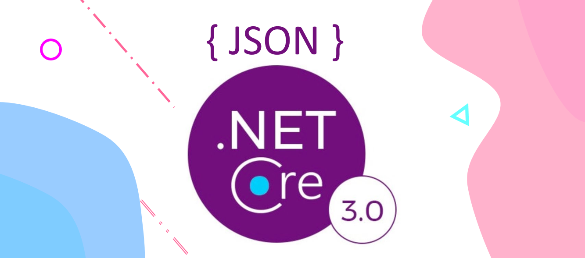

# Working with JSON in .NET Core 3

## [Medium Post](https://codeburst.io/working-with-json-in-net-core-3-2fd1236126c1)

With the introduction of ASP.NET Core 3.0 the default JSON serializer has been changed from Newtonsoft.Json to the native System.Text.Json. In this blog post, we will go over some basic usages of JSON serialization and deserialization.

## License

Feel free to use the code in this repository as it is under MIT license.

